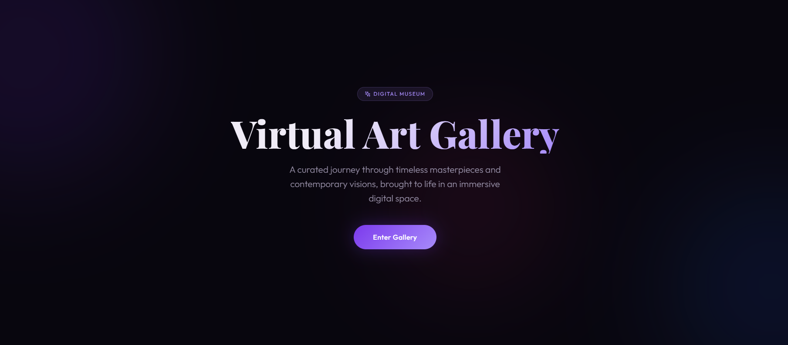
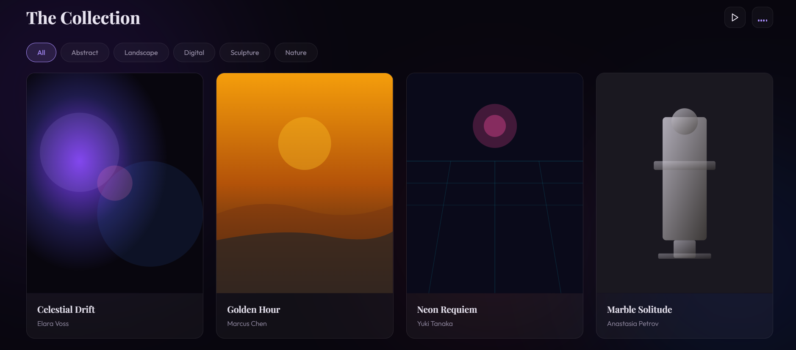
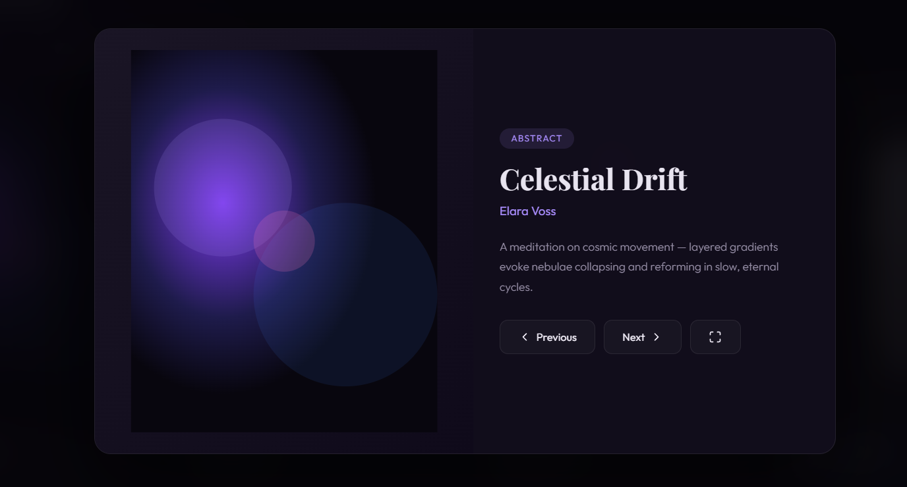

## 🎨 Virtual Art Gallery

A modern, immersive Virtual Art Gallery built using HTML, CSS, and JavaScript. This project showcases digital artworks in a beautifully designed interactive gallery with animations, filters, slideshow mode, and ambient music.

---

### 🌟 Features
🎭 Landing Page Experience<br>
    -> Elegant intro screen with smooth animations<br>
    -> “Enter Gallery” transition effect<br>
🖼️ Dynamic Art Gallery<br>
    -> Responsive grid layout<br>
    -> Beautiful artwork cards with hover effects<br>
🏷️ Category Filters<br>
    -> Filter artworks by category (Abstract, Landscape, Digital, etc.)<br>
    -> Smooth UI interactions<br>
🔍 Artwork Modal View<br>
    -> View artwork details in fullscreen modal<br>
    -> Includes title, artist, and description<br>
    -> Navigation (Next / Previous)<br>
🎬 Slideshow Mode<br>
    -> Automatically cycles through artworks<br>
    -> Visual indicator when active<br>
🎵 Ambient Music<br>
    -> Built using Web Audio API<br>
    -> Toggle background sound with visualizer<br>
✨ Modern UI Design<br>
    -> Glassmorphism effects<br>
    -> Gradient typography<br>
    -> Ambient glowing background orbs<br>
⚡ Animations<br>
    -> Loading screen<br>
    -> Smooth transitions<br>
    -> Card reveal effects<br>


---

### 📸 Screenshots

🏠 Landing Page



🖼️ Gallery View



🔍 Artwork Modal



---

### 🛠️ Technologies Used
HTML5<br>
CSS3<br>
JavaScript (Vanilla JS)<br>
Tailwind CSS (CDN)<br>
Lucide Icons<br>
Web Audio API<br>

---

### 📁 Project Structure
Virtual-Art-Gallery/
│
├── index.html      # Main HTML structure
├── style.css       # Styling and animations
├── app.js          # Functionality and logic
├── image-1.png
├── image-2.png
├── image-3.png 
└── README.md       # Project documentation

---

### 🚀 How to Run the Project
1. Download or clone this repository:<br>
```Bash
git clone https://github.com/upasana-nayak307/Virtual-gallery.git
```
2. Open the project folder<br>
3. Run the project:<br>
    Simply open `index.html` in your browser<br>


---

### 🎮 How to Use

Click "Enter Gallery" to start<br>
Use filters to explore categories<br>
Click on any artwork to view details<br>
Use:<br>
⬅️ ➡️ for navigation<br>
🔳 for fullscreen<br>
Enable:<br>
▶️ Slideshow mode<br>
🎵 Music toggle<br>

---

### 🎨 Customization

You can easily customize:<br>

🎭 Gallery title & subtitle (in app.js)<br>
🎨 Colors using CSS variables<br>
🖼️ Add new artworks inside:<br>
```Javascript
const artworks = [ ... ]
```
🏷️ Categories update automatically<br>

---

### 💜 Preview
Aesthetic dark-themed digital gallery with:<br>

- Smooth animations<br>
- Interactive UI<br>
- Immersive experience<br>

---

### 💡 Future Improvements
🔐 User authentication<br>
🛒 Buy/Sell artwork feature<br>
🌐 Backend integration<br>
📱 Mobile app version<br>
❤️ Like/Favorite system<br>

---

### 👩‍💻 Author
**Upasana Nayak**<br>
Full-Stack Developer

---

### 📄 License
This project is open-source and free to use.